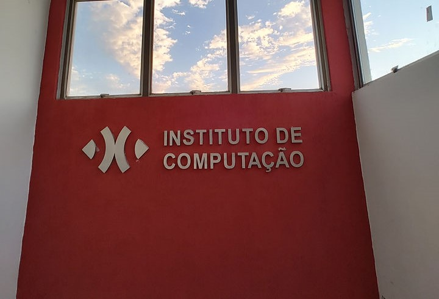

Bem-vindo ao curso de Introdução à Programação com Python do IC/UFRJ

Você pode acessar as aulas na [lista de aulas](./aulas/index.html) ou na barra barra lateral (em modo desktop), ou no menu hambúrguer (em dispositivos móveis).

